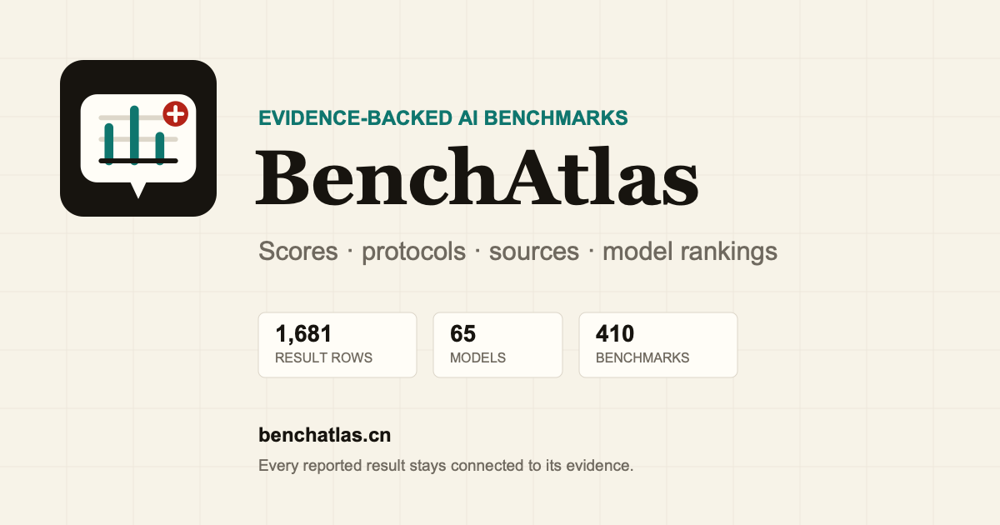

# BenchAtlas

**Explore the landscape of AI benchmarks with source evidence and evaluation context.**

[Open BenchAtlas](https://benchatlas.cn/) · [Overall model ranking](https://benchatlas.cn/ranking/) · [Report a data issue](https://github.com/LIXINGHANG/benchatlas/issues/new?template=data-correction.yml)



BenchAtlas turns official model cards and technical reports into an explorable benchmark atlas. Instead of showing a score without context, every result keeps its source, evidence location, evaluation protocol, and method notes whenever the report provides them.

## Why BenchAtlas

AI benchmark numbers are often difficult to compare. Two vendors may report the same benchmark with different agent harnesses, context windows, tool access, sampling settings, task subsets, judges, or run counts.

BenchAtlas is designed to answer four questions:

1. Which benchmarks appear in each model report?
2. What scores were reported for each model?
3. Under what environment and evaluation protocol were those scores produced?
4. How do models rank when the available reports contain comparable results?

## Current coverage

| Data | Coverage |
| --- | ---: |
| Reported result rows | 1,681 |
| Normalized models | 58 |
| Raw model labels | 65 |
| Benchmark groups | 401 |
| Source reports | 11 |
| Protocol records | 386 |
| Results in documented shared-protocol groups | 695 |
| Source-scoped results | 986 |

Coverage changes as new official reports are imported. The live site is the source of truth for current totals.

## Features

- **Spatial Atlas**: discover high-coverage benchmarks as domain-clustered, searchable map nodes.
- **Catalog and Matrix**: switch from spatial discovery to dense lookup or a selectable model-by-benchmark comparison.
- **Benchmark view**: compare reported scores, protocols, and source evidence.
- **Model view**: inspect every benchmark result associated with one model.
- **Overall ranking**: explore the Reported Performance Index with coverage and confidence signals.
- **Structured Method notes**: separate setup, reasoning, agent/tools, dataset, aggregation, and source caveats.
- **Shareable pages**: every model and benchmark has an indexable permalink.
- **Shareable exploration state**: benchmark, protocol, view, filters, and Matrix models are encoded in the URL.
- **Model-filtered atlas**: select a model to reveal its benchmark coverage, reported scores, domains, and protocol-specific ranking position.
- **Lazy benchmark loading**: the homepage loads a compact catalog before fetching benchmark evidence on demand.
- **Scoped detail bundles**: model, benchmark, and ranking pages load only the rows required for that route.
- **Evidence-first data**: each row remains linked to its originating report and evidence location.

## Overall ranking methodology

The Reported Performance Index (RPI) is a coverage-adjusted summary of published benchmark rankings. It is not an absolute model capability score.

1. For each benchmark, select the largest documented shared-protocol group; use a source-scoped group only when no strict group exists.
2. Within each eligible comparison group, model ranks are converted to a 0–100 percentile.
3. Benchmark percentiles are averaged within each domain.
4. Domains receive equal weight so one heavily reported domain does not dominate the result.
5. Limited benchmark coverage is shrunk toward 50.
6. A comparison group needs at least three models from two vendors.
7. A model needs at least five eligible benchmark groups across two domains.

Because the index uses vendor-published reports, it may inherit benchmark-selection and reporting bias. Always inspect the underlying rows before drawing strong conclusions.

## Map taxonomy

The Spatial Atlas groups report-native domain labels into six stable capability regions:

1. Reasoning & Knowledge
2. Coding & Software Engineering
3. Agents & Computer Use
4. Multimodal & Perception
5. Language & Long Context
6. Expert & Frontier Domains

Safety is an orthogonal layer rather than a separate capability region. A vision-safety benchmark remains in Multimodal & Perception, for example, while receiving a visible safety marker and participating in the Safety layer filter. Original report-native domain labels remain preserved in the dataset and evidence views.

The homepage map is a balanced landmark view rather than a rendering of every catalog row. It selects the seven most-covered benchmarks in each capability region, with no more than two variants from one benchmark family. Zoom controls expose three information levels: overview shows three core landmarks per region, field view reveals all 42 landmarks, and detail view adds benchmark metadata and semantic relationships. Solid red routes connect variants from the same benchmark family; dashed blue routes connect each landmark to its strongest peer by shared reported models. Subfield routes organize landmarks into task-level neighborhoods such as software engineering, terminal systems, computer use, long context, and health.

## Data policy

- Reported numbers are preserved rather than silently normalized.
- Protocol variants remain visible when evaluation settings differ.
- Multiple reported results may be retained for the same model and benchmark.
- Source evidence and short quotations are included for verification.
- Corrections should cite an official report page, table, figure, footnote, or methodology section.

## Normalization and comparability

- Raw model labels are mapped to stable `model_id` values using the public rules in [`data/normalization_rules.json`](data/normalization_rules.json).
- Benchmark spelling aliases map to a stable `benchmark_family_id`; dataset subsets, harnesses, metrics, and tool variants remain separate.
- Every reported row receives a `comparability_group_id` derived from benchmark variant, metric, score direction, harness, tools, timeout, compute, context, sampling, reasoning mode, runs, judge, and dataset notes.
- Rows with a documented shared setup may rank together. Rows without enough methodology remain source-scoped and are never silently mixed into a strict comparison.
- When the same model has conflicting scores inside one protocol group, BenchAtlas keeps every source row and uses the model vendor's own official report as the displayed value when available; third-party reports remain selectable as source variants.
- Harness/tool labels that were previously separate benchmark pages now remain protocol groups inside one canonical benchmark page; real benchmark versions remain separate.
- The homepage defaults to the largest documented shared-protocol group and lets readers inspect alternative source groups explicitly.

## Contributing

The most useful contributions are:

- submitting a newly released official model card;
- correcting a score, model name, metric, or evidence location;
- adding missing evaluation protocol details;
- improving benchmark normalization and comparability rules;
- improving the explorer and data-review workflow.

Read [CONTRIBUTING.md](CONTRIBUTING.md), then use one of the issue templates or open a pull request.

## Local development

BenchAtlas is a static site with no required build framework.

```bash
python3 -m http.server 4173
```

Open `http://127.0.0.1:4173/`.

To split the homepage data and regenerate model pages, benchmark pages, ranking pages, and `sitemap.xml` after updating the bundled data:

```bash
node scripts/generate-seo-pages.js
```

## Repository structure

| Path | Purpose |
| --- | --- |
| `index.html` | Spatial Atlas homepage, Catalog, Matrix, and evidence inspector |
| `app.js` | Legacy detail views, filtering, routing, and ranking logic |
| `site_data.bundle.js` | Bundled normalized benchmark dataset |
| `site_data.index.bundle.js` | Compact homepage catalog without benchmark detail rows |
| `data/benchmarks/` | Per-benchmark JSON loaded on demand by the Spatial Atlas |
| `data/pages/` | Route-scoped bundles for benchmark, model, and ranking pages |
| `data/normalization_rules.json` | Auditable model and benchmark alias rules |
| `scripts/generate-seo-pages.js` | Generates clean, indexable detail URLs |
| `scripts/split-site-data.js` | Splits the full bundle into the homepage index and lazy benchmark files |
| `models/` | Generated model pages |
| `benchmarks/` | Generated benchmark pages |
| `ranking/` | Generated overall ranking page |

## Citation

If BenchAtlas supports your research or analysis, cite the repository and include the date you accessed the data:

```text
BenchAtlas: Explore the landscape of AI benchmarks.
https://github.com/LIXINGHANG/benchatlas
Accessed YYYY-MM-DD.
```

## License

Original source code is released under the [MIT License](LICENSE). Official model reports, quoted excerpts, model names, benchmark names, and other third-party materials remain the property of their respective owners; see [THIRD_PARTY_NOTICES.md](THIRD_PARTY_NOTICES.md).

## 中文简介

BenchAtlas 将模型厂商发布的 Model Card 和技术报告整理成可检索、可核验的 benchmark 数据库。网站不仅展示分数，还保留运行环境、Agent Harness、工具权限、采样参数、评测次数、裁判模型和原始证据位置。欢迎通过 Issue 提交新报告或指出数据问题。
